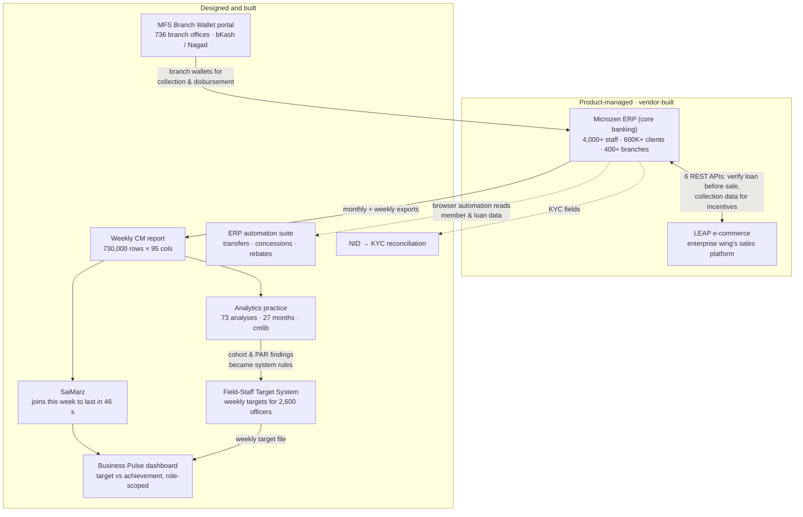

# Md. Mominul Haque (Pabel)

**Product manager, microfinance ERP and digital transformation · Dhaka, Bangladesh**

From 2024 to 2026 I carried the product function for the core banking platform of a
400-branch microfinance institution, and I built the analytical and operational systems
that platform needed but did not have. The two halves of that work call for different
skills, and this profile keeps them distinct so that each can be judged on its own terms.

| | Microzen ERP: product management | The systems around it: design and build |
|---|---|---|
| **Scale** | 4,000+ staff · 600,000+ clients · 400+ branches | 2,600 field officers · 736 branch offices · a 730,000-row weekly file |
| **My work** | Requirements discovery, eight BRDs and an API contract, user stories and process maps, vendor backlog and release sign-off, UAT, stakeholder alignment across Operations, Finance, Risk and ICT | Architecture, data model, code, tests and rollout for target allocation, the Business Pulse dashboard, weekly-file reconciliation, mobile-wallet onboarding, ERP automation and NID reconciliation, on an AI-assisted, human-gated pipeline |
| **Delivered by** | Analyzen Bangladesh Ltd., to specification | Me, with no vendor and no budget |
| **Evidence** | Specifications, scenario suites, governance records | Repositories, tests, release tags, live adoption |

Underneath both sits a three-year analytics practice: 73 analyses in seven programmes,
answering the regulator, finance, programme heads and donors from one monthly export.

Case studies with the problem, the before-and-after, the numbers and the rule each system
refuses to break: **[pabel64.github.io/portfolio](https://pabel64.github.io/portfolio/)**.
Code is private because it ran against organisational data; walkthroughs, architecture
documents and dummy-data demonstrations are available on request.

---

## How the systems fit together

Every arrow above is a real data flow. The dotted ones are browser automation against the ERP
because it exposes no API for that data.

---

## Microzen: the core ERP, product-managed

Microzen is the core banking system of Padakhep Manabik Unnayan Kendra (PMUK), delivered
and maintained by Analyzen Bangladesh Ltd. From August 2024 to 2026 I held the product
function on the organisation's side: what gets built, in what order, to what standard, and
whether it is accepted.

| What | Detail |
|---|---|
| Backlog and support | Ran the enhancement backlog with the vendor; 450+ support cases resolved in the first year of the engagement |
| Microzen 2.0 requirements | Authored eight BRDs for the rebuild, positioned as a multi-tenant SaaS for other MFIs: system administration and geo hierarchy · member lifecycle management · micro and ME loan processing (nine-level approval chain) · business strategy and risk monitoring (red flags, SLA ladder, BI-driven sampling) · incident and impact management (disaster lifecycle with a weighted branch risk score) · MRA/PKSF replica reporting (approval-gated external reporting with NFRs) · system-admin addendum (samity types, campaign waivers, cheque control, loan classification, bulk product assignment) |
| Amortised loans | Specified declining-balance loan servicing through eight borrower scenarios (grace period, early payment, missed instalments, early closure, bullet repayment, holiday shifts); rolled out across 395 branches from September 2025 |
| Digital KYC | Drove field adoption; removed paper re-entry from member onboarding |
| Governed rollback | Designed the correction path Microzen 1.0 lacked: ICT-only execution, two-tier approval, scoped to specific transactions on a specific date, immutable rollback log |
| Business Pulse metrics | Specified the operations metric set (OTR, PAR, CR, DR, savings, staff productivity, MRA classification) with drill-down from organisation to individual credit officer, later implemented in-house as the Business Pulse dashboard |
| Governance | Worked inside the organisation's automation governance: an executive advisory committee, a coordination committee and eight departmental sub-committees; departmental requests became BRDs through this path |

What this work looks like: a BRD with numbered business rules and non-functional requirements
the vendor is held to (for example, 30-second report generation for 200 branches, 99.5% uptime
in business hours, WCAG 2.1 AA on the external portal), a gap analysis when a draft was not
good enough, and a fund-requisition review tracking 16 year-one workstreams against plan.

---

## LEAP e-commerce and the Microzen–LEAP API

LEAP (Padakhep Life Enhancement Program) is the enterprise wing's sales platform: members buy
products against their loans, and field staff earn incentives on the collections that follow.
I managed its enhancement roadmap and authored the integration contract with the core ERP.

**Six REST/JSON APIs, specified October 2025:**

| API | Direction | What it enforces |
|---|---|---|
| Member information | LEAP → Microzen | Auto-fill name, mobile and NID from the member ID; no retyping at the point of sale |
| Loan verification before sale | LEAP → Microzen | A "check disbursement status" step; **no product can be sold against a loan that has not been disbursed** |
| Sales confirmation | LEAP → Microzen | Each sale recorded against its loan and the staff member who made it |
| Collection data, per loan | LEAP → Microzen, quarterly | Percentage collected per staff member with overdue and tenure flags, so incentives are computed from verified repayment, not from self-reported sales |
| Collection data, bulk | LEAP → Microzen, quarterly | The same for all loans at once |
| Employee information | LEAP → Microzen | Branch, area and zone mapping for attribution |

Business rules in the contract: excluded income-generating-activity types, overdue and
active-tenure flags, retroactive incentive when a member regularises, and incentive credited
to the staff member who achieves the regularisation. A later pre-disbursement check runs the
other way: Microzen asks LEAP whether ordered products were received at the branch before a
loan is disbursed. Also settled: a product's price may not exceed 10% of the approved loan,
and branch names are harmonised across both systems so records join cleanly.

---

## Systems designed and built

| System | One line | Number | Status | Code |
|---|---|---|---|---|
| Field-Staff Target System | Splits each branch target across its officers by a weighted formula so the parts sum exactly to the whole, with a full audit trail | ~18,000 weekly targets for 2,600 officers in 409 branches | Weekly process live since July 2026 | `PMUK-Target-System` (private) · [case study](https://pabel64.github.io/portfolio/projects/pmuk-target-system.html) |
| Business Pulse dashboard | Weekly target vs achievement, rolled up officer → division, each manager sees only their own units | 568 branch offices, 27,122 samities loaded; 488 backend tests | In weekly use since July 2026 | `AK47-Dashboard` (private) · [case study](https://pabel64.github.io/portfolio/projects/ak47-dashboard.html) |
| SaiMarz | Offline desktop tool that joins two 730,000-row weekly workbooks and reports duplicate-key conflicts VLOOKUP hides | 46 seconds, was a crash-prone 30 minutes | In weekly use | `saimarz` (private) · [case study](https://pabel64.github.io/portfolio/projects/saimarz.html) |
| MFS Branch Wallet portal | bKash / Nagad merchant-wallet onboarding for branch offices with a maker-checker workflow and generated provider packs | 731 branch users · 189 registrations · median 0.8-day verification | Live since June 2026 | Not published · walkthrough on request |
| ERP automation suite | Three tools on one browser-automation layer: transfer-eligibility checks, a concession register mined from WhatsApp, a rebate pipeline from email to verified SMS list | 257 applications across 141 branches; 4 ineligible rebates caught | Single-operator tools | `transfer-automation` · `padakhep-rebate-automation` · `special-rebate-automation` (private) |
| NID → KYC reconciliation | Reads the NID card barcode first, OCR as fallback, resolves the member by NID then name + date of birth, and queues mismatches for review | 4 of 5 stages built | Active | `document-extraction-engine` (private) · [case study](https://pabel64.github.io/portfolio/projects/document-extraction-engine.html) |
| Reports and Analytics | 27 months of regulator, finance and donor questions answered from one monthly export, consolidated onto a shared library that defines each number once | 73 analyses in 7 programmes | Practice, 2023–2026 | `reports-and-analytics` (private) · [case study](https://pabel64.github.io/portfolio/projects/reports-and-analytics.html) |

---

## How I build

A gated, AI-assisted delivery pipeline of my own: 71 specialist agents, 38 stages and four
human approval gates (clarify, requirement, mockup, pull request), with artefact verification
no agent can fake and an adversarial critic that blocks work for being merely correct. It built
the target system, the dashboard and the study platform. Repository: `factory-agent-overlay`
(private) · [case study](https://pabel64.github.io/portfolio/projects/factory-agent-overlay.html).

Design habits that show up in every system above: the parts must sum to the whole; unknown
stays unknown rather than guessed; nothing is auto-approved or auto-sent; every decision leaves
an audit row; Bengali text and leading-zero identifiers are handled on purpose.

---

## Contact

mdmominul97haque@gmail.com · [LinkedIn](https://www.linkedin.com/in/md-mominul-haque) ·
[Portfolio](https://pabel64.github.io/portfolio/)
